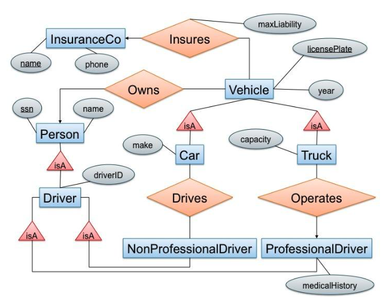

# Database Design
Practice drawing entity-relationship diagrams, translating from entity-relationship diagrams to relational databases, considering functional dependencies, and designing databases.

 ## Overview of files
 ### [geography.pfd](geography.pdf)
 Entity-relationship diagram for geography that contains the following objects or entities with listed attributes:

*Entities*:
- countries (with attributes): name, area, population, GDP ("gross domestic product") 
    - a country's name uniquely identifies the country within all countries
- cities: name, population, longitude, latitude
    - a city is uniquely identified by its (longitude, latitude) (not by name)
- rivers: name, length
    - rivers are uniquesly identified within all water entities by their name (e.g., "Ganges" would be a unique water entity)
- seas: name, max depth
    - seas are uniquely identified within all water entities by their name

*Relationships*:
- each city belongs to exactly one country
- each river crosses one or several countries
- each country can be crossed by zero or several rivers
- each river ends in either a river or a sea

 ### [driving.sql](driving.sql)
 CREATE TABLE statments that represent the entity/relationship diagram depicted in [driving_erdiagram.png](driving_erdiagram.png) (including all key constraints; all primary and foreign keys are specified):

License plate can have letters and numbers; driverID and Social Security contain only numbers; maxLiability is a real number; year, phone, capacity are integers; everything else are strings.

Comment 1 explains which relation in the relational schema represents the relationship "insures" in the E/R diagram and why that is the representation I chose.

Comment 2 compares the representation of the relationships "drives" and "operates" in my schema, and explains why they are different.

### [theory.txt](theory.txt)
Written answers to questions about BCNF decomposition, closed sets of attributes and functional dependencies. Questions 1 and 2 involve decomposing schemas into BCNF given a set of functional dependencies. Question 3 involves identifying sets of functional dependencies consistent with a closed attribute set and an verall relation schema.

### [frumble.sql](frumble.sql)
A set of exercises centered on the messy dataset stored in [mrFrumbleData.txt](mrFrumbleData.txt).
1. Creates a table in the database to store data from [mrFrumbleData.txt](mrFrumbleData.txt) and imports data.
2. Queries that find all non-trivial functional databases in the system. Comment includes description of how queries address all possible candidate dependencies.
3. Decomposes the table into BCNF and create SQL tables for the decomposed schema. Creates keys and foreign keys where appropriate.
4. Queries that load and report the sizes of the new tables.
